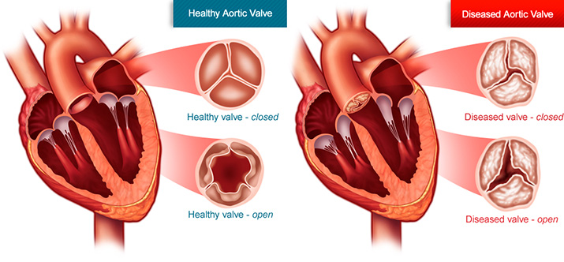
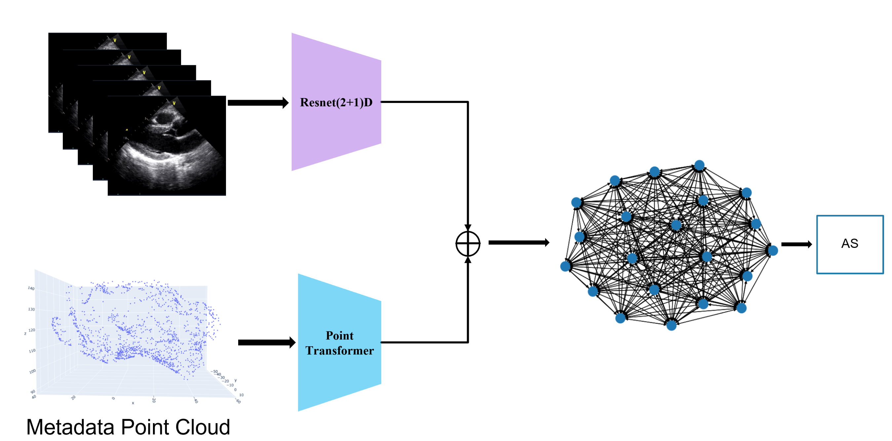

## Summary

This project incorporates Graph Neural Networks (GNNs), Point Clouds, and Resnet(2+1)D to improve the classification of the Aortic Stenosis (AS)
Aortic Stenosis (AS) is a severe heart disease that can be caused by calcification or restricted motion of the aor- tic valve. While deep learning models have shown promis- ing results in predicting heart-related diseases, they often rely solely on analyzing echocardiograms and neglect the associated non-image data of patients. In this study, we propose a multi-modal deep learning approach that lever- ages both echocardiogram images and metadata to detect AS severity. Our model aims to identify potential higher-order relationships between different modalities of data to improve classification accuracy. We evaluate our method on a dataset of patients with AS and compare its performance to existing models that only use echocardiogram data. Our results demonstrate that incorporating non-image data im- proves the accuracy of AS severity classification, which may ultimately lead to better diagnosis and treatment planning for patients.

<p align="center">
  
</p>

## Model Architecture
<p align="center">
  
</p>
The model includes a Resnet18 backbone to extract the embeddings from the video, and a Point Transformer model is used to extract the embeddings from the metadata point cloud. The metadata embeddings are then concatenated to each image and passed as feature vectors to a Graph Attention Network (GAT) network to classify AS severity. 


## Training Instructions

To train the model, follow these steps:

1. **Prepare the data:**
   - Ensure your echocardiogram videos are in a compatible format (.mat)
   - Prepare the metadata in a CSV file with patient information and relevant clinical data.

2. **Set up the environment:**
   - Install the required dependencies using the `requirements.txt` file.

3. **Configure hyperparameters:**
   - Update the `config` file and adjust the hyperparameters as needed

4. **Run the training script:**
   ```sh
   python run.py --config_path [path_to_config]
   ```
   alternatively you can use the `run.sh` to run the training.

